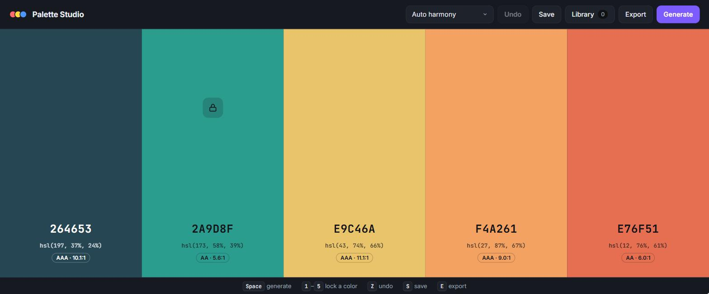

<div align="center">

# 🎨 Palette Studio

**Generate beautiful, accessible color palettes, right in your browser.**

[](https://zubair9590-svg.github.io/palette-studio/)


<a href="https://zubair9590-svg.github.io/palette-studio/"></a>

</div>

## ✨ Features

- **Five color harmonies**: analogous, monochromatic, complementary, triadic and split-complementary, or let *Auto* surprise you
- **Lock the colors you love.** Locked colors stay put, and new colors are generated to harmonize with them
- **Accessibility built in**: every swatch shows its WCAG contrast ratio and rating (AAA / AA / AA Large)
- **Fine-tune any color** with the built-in color picker
- **Export** to CSS custom properties, SCSS variables or JSON, or copy a **shareable link**
- **Save palettes** to your personal library (stored locally in your browser)
- **Undo**, keyboard shortcuts and a fully **responsive** layout
- **Zero dependencies**: plain HTML, CSS and JavaScript

## ⌨️ Keyboard shortcuts

| Key | Action |
| --- | --- |
| <kbd>Space</kbd> | Generate a new palette |
| <kbd>1</kbd> – <kbd>5</kbd> | Lock / unlock a color |
| <kbd>Z</kbd> or <kbd>Ctrl</kbd> + <kbd>Z</kbd> | Undo |
| <kbd>S</kbd> | Save to library |
| <kbd>E</kbd> | Export |

## 🚀 Run it locally

No build step needed. Clone the repo and serve the folder with any static server:

```bash
git clone https://github.com/zubair9590-svg/palette-studio.git
cd palette-studio
npx serve .        # or: python -m http.server
```

Then open the printed URL (for example `http://localhost:3000`).

## 🧠 How it works

- **Harmonies**: a base hue is picked (or taken from your first locked color), then each swatch is offset around the color wheel according to the chosen harmony. Lightness is spread across the palette so there is always a range from dark to light.
- **Contrast**: colors are converted to relative luminance using the WCAG 2 formula, and the ratio against white or dark text decides the label color and the AA/AAA rating.
- **Sharing**: the current palette is kept in the URL hash (for example `#/264653-2A9D8F-E9C46A-F4A261-E76F51`), so any palette can be bookmarked or shared.

## 📁 Project structure

```
palette-studio/
├── index.html    # markup and dialogs
├── style.css     # layout, theming and responsive styles
├── app.js        # color math, palette generation and UI logic
└── favicon.svg
```

## 📄 License

[MIT](LICENSE) © Zubair
